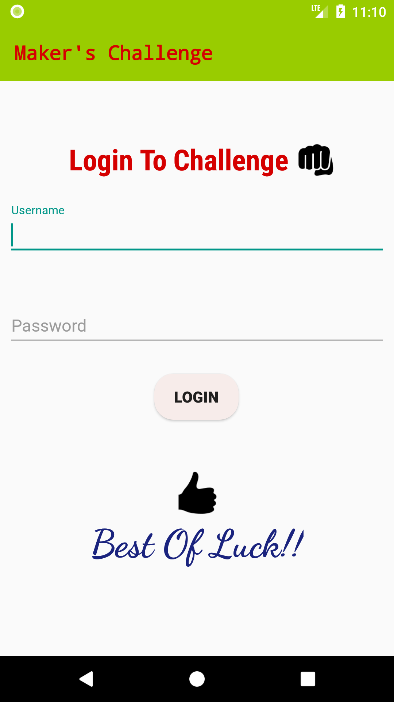
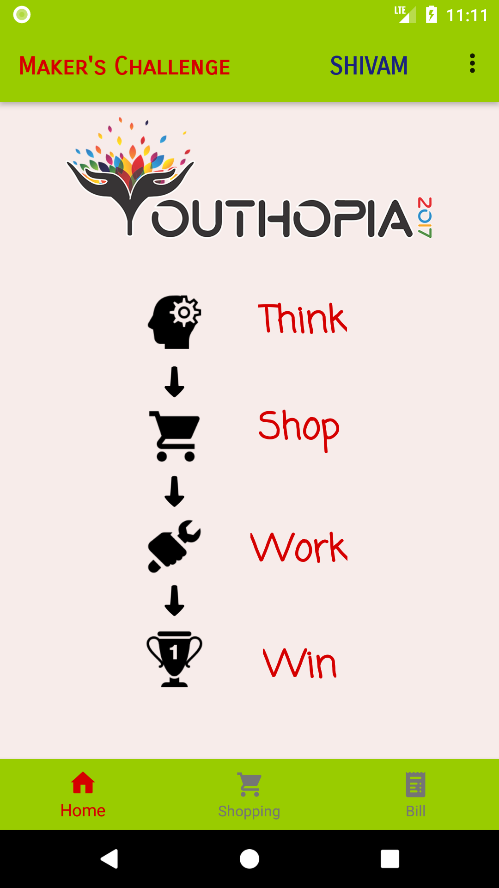
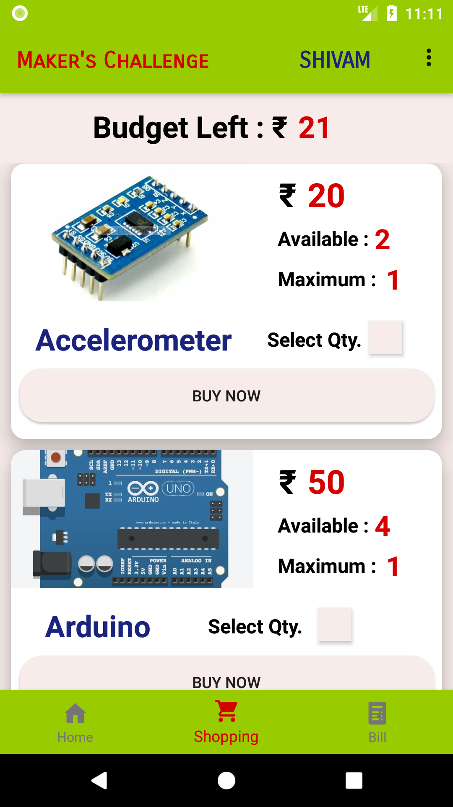
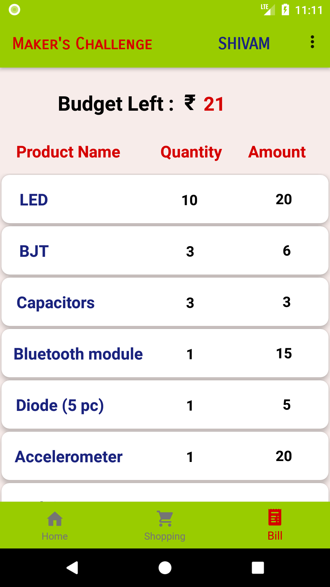

# Maker's Challenge Youthopia 2k17 IEEE Event App

<h1>Idea of Event</h1>
<b>The idea of the Event is to let it's Participants Create a Unique & Useful Product from various Electronics Components.</b>
<ul>
  <li>Participants are given a Certain Budget.</li>
  <li>There are various Electronics Components to choose from like : 
    <ul>
      <li>Arduino UNO</li>
      <li>Bread Board</li>
      <li>LEDs</li>
      <li>Various Sensors</li>
      <li>Resistors</li>
      <li>Wires etc...</li>
    </ul>
  </li>
  <li>Every Component has some Price associated with it.</li>
  <li>Participants have to buy these Components as per to their needs within their given budget.</li>
  <li>Within a given time limit Participants have to create their respective Ideas.</li>
  <li>The best Idea with it's Execution Wins.</li>
</ul>

<h1>What does this App Offer ?</h1>
<b>To create a buzz among Participants we decided to Let the Core Idea happen using an App.</b>
<ul>
  <li>Login ID : Participants are given Login ID</li>
  <li>Shopping Solution for Participants.</li>
  <li>Admin Monitoration : How much budget to Allocate or Which Products to List.</li>
  <li>Bill Section : After Successful purchases Participants have to Report to Admin to Collect their Components.</li>
  <li>Concurrency Management</li>
</ul>

<h1>Technologies Used</h1>
<ul>
<li>ANDROID Libraries</li>
<li>JAVA</li>
<li>Firebase</li>
<li>PHP</li>
<li>MYSQL</li>
</ul>

<h1>Glimpses of Maker's Challenge</h1>
<table>
  <tr>
    <th></th>
    <th></th>
  </tr>
  <tr>
    <th></th>
    <th></th>
  </tr>
  
</table>

<h1>Download Apk</h1>
<a href = "https://raw.githubusercontent.com/ashishlkhmn48/Makers_Challenge/master/images/mc.apk">Click here to Download</a>
 
shivam : devanshi

<h1>Backend Files of DIT SPHERE for Reference</h1>
https://github.com/ashishlkhmn48/Makers_Challenge_Files

<h1>References</h1>
  <ul>
  <li>https://docs.back4app.com</li>
  <li>https://github.com/parse-community/Parse-SDK-Android</li>
  <li>https://github.com/parse-community/parse-php-sdk</li>
  <li>https://firebase.google.com/docs/android/setup</li>
  <li>https://developer.android.com/reference/org/w3c/dom/Document.html</li>
  <li>https://www.w3schools.com</li>
  <li>https://stackoverflow.com</li>
</ul>
